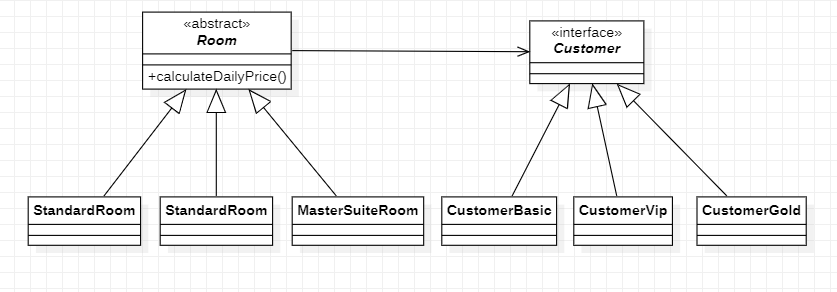

# Padrões de Projeto

## 2. Padrões de Criação:
___
### 2.2 Bridge

#### 2.2.1 Introdução
O Bridge é um padrão de projeto estrutural que permite que você divida uma classe grande ou um conjunto de classes intimamente ligadas em duas hierarquias separadas—abstração e implementação—que podem ser desenvolvidas independentemente umas das outras.
#### 2.2.2 Exemplo abordado

Como exemplo para este padrão abordei o tema de quartos de hoteis de diferentes tipos e com perfis de clientes variados 
#### 2.2.3 Diagrama de Classe do Exemplo

